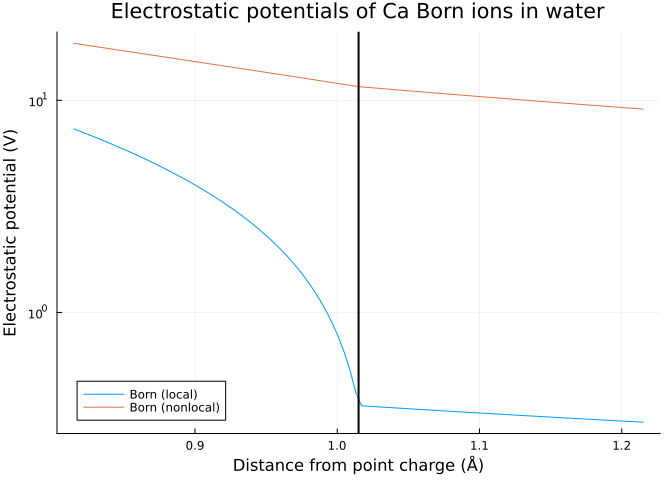
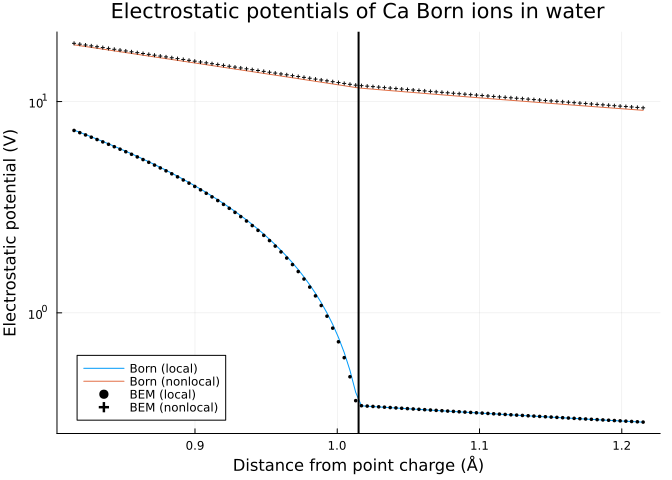

# Born ions


In this first tutorial, we’ll explore simple monoatomic systems that are spherically symmetric. We’ll be working with what are called *Born ions* - idealized models of ions represented as vacuum-filled spheres, with a single point charge sitting right at the center. For such systems, the electrostatic potentials can be computed analytically, which allows us to compare them to numerical approximations.

Let’s start by generating a calcium ion and some observation points `Ξ`, evenly spaced along a line perpendicular to the ion “surface”:

``` julia
using NESSie.TestModel

name = "Ca"
ion  = bornion(name)
Ξ    = LinRange([0, 0, ion.radius - 0.2], [0, 0, ion.radius + 0.2], 100)
```

By default, the ion sphere is assumed to be embedded in water. For a given Born ion and observation points, we can then compute the local and nonlocal electrostatic potentials using the [`espotential`](@ref) function and visualize the results as shown below:

``` julia
using Plots

born_local    = espotential(LocalES, Ξ, ion)
born_nonlocal = espotential(NonlocalES, Ξ, ion)

p = plot(getindex.(Ξ, 3), [born_local, born_nonlocal];
    title  = "Electrostatic potentials of $name Born ions in water",
    label  = ["Born (local)" "Born (nonlocal)"],
    xlabel = "Distance from point charge (Å)",
    ylabel = "Electrostatic potential (V)",
    legend = :bottomleft,
    yscale = :log10
)

# mark ion surface as vertical line
vline!(p, [ion.radius]; color = :black, lw = 2, label = nothing)
```



Before we can compute the numerically approximated potentials, we first need to generate a suitable triangle mesh for the ion surface. This can be achieved through the [`Model`](@ref) constuctor:

``` julia
model = Model(ion; lc_max = 0.08)
```

    Info    : Meshing 1D...
    Info    : [ 40%] Meshing curve 2 (Circle)
    Info    : Done meshing 1D (Wall 9.4727e-05s, CPU 9.4e-05s)
    Info    : Meshing 2D...
    Info    : Meshing surface 1 (Sphere, Frontal-Delaunay)
    Info    : Done meshing 2D (Wall 0.0616688s, CPU 0.060676s)
    Info    : 2467 nodes 4972 elements
    Info    : Writing '/tmp/jl_ROZCZkNMDG.msh'...
    Info    : Done writing '/tmp/jl_ROZCZkNMDG.msh'

    NESSie.Model{Float64, NESSie.Triangle{Float64}}(nodes = 2467, elements = 4930, charges = 1)

The `lc_max` parameter essentially controls the number of triangles the sphere is represented by and can be set according to the particular input at hand. Electrostatic potentials can then again be computed using the same [`espotential`](@ref) function as before, albeit with a different set of parameters, generated from the `model`:

``` julia
using NESSie.BEM

bem_local    = espotential(Ξ, solve(LocalES,    model; method = :blas))
bem_nonlocal = espotential(Ξ, solve(NonlocalES, model; method = :blas))

plot!(p, getindex.(Ξ, 3), [bem_local, bem_nonlocal];
    label = ["BEM (local)" "BEM (nonlocal)"],
    marker = [:circle :plus],
    markersize = 2,
    markercolor = :black,
    linetype = :scatter
)
```



The approximated potentials (“BEM”) are here shown on top of the analytical potentials (“Born”).
