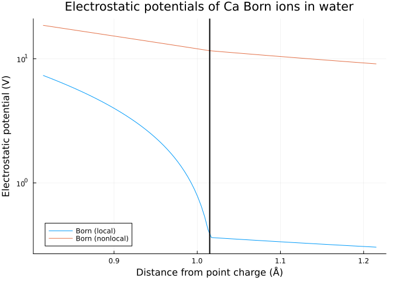
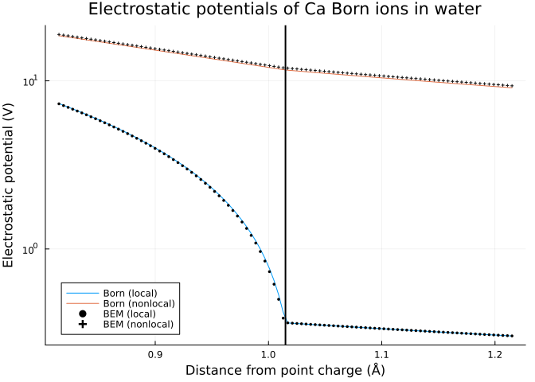

# Born ions


In this first tutorial, we’ll explore simple monoatomic systems that are spherically symmetric. We’ll work with *Born ions* — idealized models of ions represented as vacuum-filled spheres, with a single point charge at the center. For such systems, the electrostatic potentials can be computed analytically, which allows us to compare them to numerical approximations.

## Analytical potentials

Let’s start by generating a calcium ion and some observation points `Ξ`, evenly spaced along a line perpendicular to the ion “surface”:

``` julia
using NESSie.TestModel

name = "Ca"
ion  = bornion(name)
Ξ    = LinRange([0, 0, ion.radius - 0.2], [0, 0, ion.radius + 0.2], 100)
```

By default, the ion sphere is assumed to be embedded in water. For a given Born ion and observation points, we can compute the local and nonlocal electrostatic potentials using the [`espotential`](@ref) function and visualize the results as shown below:

``` julia
using Plots

born_local_es    = espotential(LocalES, Ξ, ion)
born_nonlocal_es = espotential(NonlocalES, Ξ, ion)

p = plot(getindex.(Ξ, 3), [born_local_es, born_nonlocal_es];
    title  = "Electrostatic potentials of $name Born ions in water",
    label  = ["Born (local)" "Born (nonlocal)"],
    xlabel = "Distance from point charge (Å)",
    ylabel = "Electrostatic potential (V)",
    legend = :bottomleft,
    yscale = :log10
)

# mark ion surface as vertical line
vline!(p, [ion.radius]; color = :black, lw = 2, label = nothing)
```



## BEM approximation

Before computing the numerically approximated potentials, we first need to generate a suitable triangle mesh for the ion surface. This can be achieved through the [`Model`](@ref) constructor:

``` julia
model = Model(ion; lc_max = 0.08)
```

    Info    : Meshing 1D...
    Info    : [ 40%] Meshing curve 2 (Circle)
    Info    : Done meshing 1D (Wall 8.053e-05s, CPU 8.2e-05s)
    Info    : Meshing 2D...
    Info    : Meshing surface 1 (Sphere, Frontal-Delaunay)
    Info    : Done meshing 2D (Wall 0.0647089s, CPU 0.064672s)
    Info    : 2480 nodes 4998 elements
    Info    : Writing '/tmp/jl_DgbSxgFgds.msh'...
    Info    : Done writing '/tmp/jl_DgbSxgFgds.msh'

    NESSie.Model{Float64, NESSie.Triangle{Float64}}(nodes = 2480, elements = 4956, charges = 1)

The `lc_max` parameter controls the number of triangles the sphere is represented by and can be adjusted depending on the desired accuracy. We compute the electrostatic potentials the same way, but now pass parameters derived from the `model`:

``` julia
using NESSie.BEM

bem_local    = solve(LocalES,    model; method = :blas)
bem_nonlocal = solve(NonlocalES, model; method = :blas)

bem_local_es    = espotential(Ξ, bem_local)
bem_nonlocal_es = espotential(Ξ, bem_nonlocal)

plot!(p, getindex.(Ξ, 3), [bem_local_es, bem_nonlocal_es];
    label = ["BEM (local)" "BEM (nonlocal)"],
    marker = [:circle :plus],
    markersize = 2,
    markercolor = :black,
    linetype = :scatter
)
```



The BEM-approximated potentials (markers) are overlaid on the exact Born analytical solutions (solid lines), showing close agreement between the two approaches.

## Solvation free energy

So far we’ve looked at how the electrostatic potential varies through space. A single, highly informative scalar quantity that captures the entire picture is the *polar solvation free energy* — the electrostatic work required to transfer a charge from vacuum into the solvent cavity. This is also referred to as the *reaction field energy*. In full implicit-solvent calculations the total solvation free energy also includes a nonpolar contribution (cavity formation, dispersion, etc.), but the reaction field energy is typically the dominant term for charged and polar solutes.

NESSie provides a [`rfenergy`](@ref) function that computes this quantity directly for both Born ions and BEM results — always in units of kJ/mol:

``` julia
# Analytical energies
born_local_rfe    = rfenergy(LocalES, ion)
born_nonlocal_rfe = rfenergy(NonlocalES, ion)

# BEM-approximated energies
bem_local_rfe    = rfenergy(bem_local)
bem_nonlocal_rfe = rfenergy(bem_nonlocal);
```

For the local Born model this reduces to the classic Born equation

``` math
\Delta G_\text{solv} = -\frac{q^2}{8\pi\varepsilon_0\,R}\left(1 - \frac{1}{\varepsilon_\Sigma}\right)
```

with sphere radius $R$, charge $q$ and the solvent’s dielectric constant $\varepsilon_\Sigma$, so we expect `rfenergy(LocalES, ion)` to reproduce the analytical solvation energy. The nonlocal model adds solvent correlation effects through the high-frequency dielectric constant $\varepsilon_\infty$ and the correlation length $\lambda$, which is why the local and nonlocal solvation energies differ for the same ion (with the nonlocal energies matching experimental results more closely [\[Hil05\]](@ref "Bibliography")).

``` julia
using Printf

@printf "Born local:    %.4f kJ/mol\n" born_local_rfe
@printf "Born nonlocal: %.4f kJ/mol\n" born_nonlocal_rfe
```

    Born local:    -2702.5444 kJ/mol
    Born nonlocal: -1618.8041 kJ/mol

Finally, we can check how well the BEM approximation reproduces the analytical result:

``` julia
@printf "BEM local:    %.4f kJ/mol (analytical: %.4f)\n" bem_local_rfe    born_local_rfe
@printf "BEM nonlocal: %.4f kJ/mol (analytical: %.4f)\n" bem_nonlocal_rfe born_nonlocal_rfe
```

    BEM local:    -2705.2271 kJ/mol (analytical: -2702.5444)
    BEM nonlocal: -1589.4194 kJ/mol (analytical: -1618.8041)

The close agreement confirms that the surface mesh generated with `lc_max = 0.08` is sufficiently fine for converged solvation energies.
