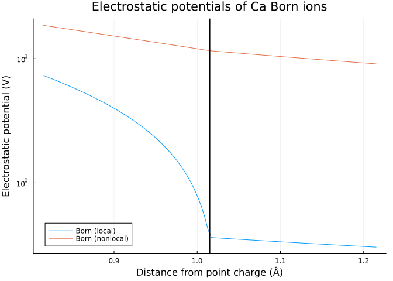

# Born ions


``` julia
using NESSie.TestModel

name = "Ca"
ion  = bornion(name)
Ξ    = LinRange([0, 0, ion.radius - 0.2], [0, 0, ion.radius + 0.2], 100)
```

``` julia
using Plots

born_local    = espotential(LocalES, Ξ, ion)
born_nonlocal = espotential(NonlocalES, Ξ, ion)

p = plot(getindex.(Ξ, 3), [born_local, born_nonlocal];
    title = "Electrostatic potentials of $name Born ions",
    label = ["Born (local)" "Born (nonlocal)"],
    xlabel = "Distance from point charge (Å)",
    ylabel = "Electrostatic potential (V)",
    legend = :bottomleft,
    yscale = :log10
)

# mark ion surface
vline!(p, [ion.radius]; color = :black, lw = 2, label = nothing)
```



``` julia
model = Model(ion; lc_max = 0.08)
```

    Info    : Meshing 1D...
    Info    : [ 40%] Meshing curve 2 (Circle)
    Info    : Done meshing 1D (Wall 9.0277e-05s, CPU 9e-05s)
    Info    : Meshing 2D...
    Info    : Meshing surface 1 (Sphere, Frontal-Delaunay)
    Info    : Done meshing 2D (Wall 0.0649158s, CPU 0.064915s)
    Info    : 2480 nodes 4998 elements
    Info    : Writing '/tmp/jl_8HAxqrknaV.msh'...
    Info    : Done writing '/tmp/jl_8HAxqrknaV.msh'

    NESSie.Model{Float64, NESSie.Triangle{Float64}}(nodes = 2480, elements = 4956, charges = 1)

``` julia
using NESSie.BEM

bem_local    = espotential(Ξ, solve(LocalES,    model; method = :blas))
bem_nonlocal = espotential(Ξ, solve(NonlocalES, model; method = :blas))

plot!(p, getindex.(Ξ, 3), [bem_local, bem_nonlocal];
    label = ["BEM (local)" "BEM (nonlocal)"],
    marker = [:circle :plus],
    markersize = 2,
    markercolor = :black,
    linetype = :scatter
)
```


