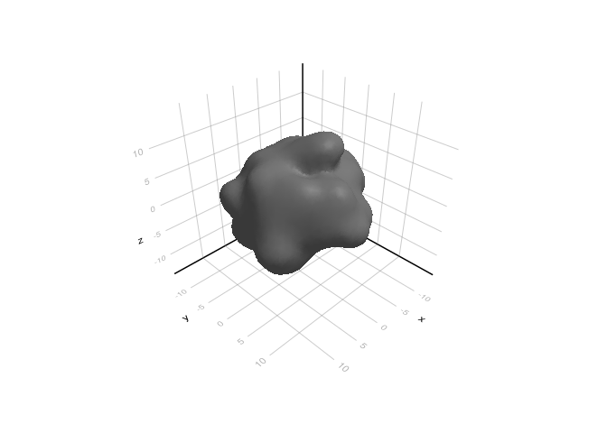
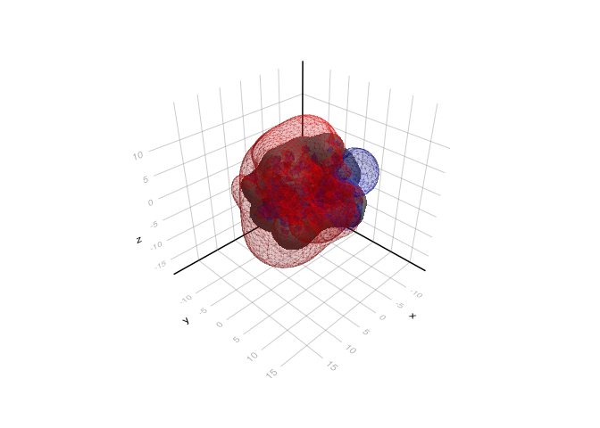

# Protein electrostatics


In this tutorial, we apply NESSie’s nonlocal boundary element method (BEM) to a real protein structure. We’ll solve the nonlocal electrostatics problem for the protein [2LZX](https://www.rcsb.org/structure/2LZX), compute the resulting electrostatic potential on a 3D grid, and visualize the positive and negative potential isosurfaces.

``` julia
using NESSie.BEM
using CairoMakie
import GeometryBasics

model = Format.readhmo(nessie_data_path("benchmark/2lzx-5k.hmo"))
bem   = solve(NonlocalES, model; method = :blas)

f, ax, plt = mesh(GeometryBasics.mesh(model); color = :gray)
```



We read the protein structure from an `.hmo` file using [`Format.readhmo`](@ref), which loads the surface mesh and embedded point charges in a single step. The electrostatic problem is then solved via the BEM with `solve(NonlocalES, model)`. The resulting `bem` object can then be used to evaluate the electrostatic potential anywhere in space.

The protein surface is rendered in gray to give context for the potential visualization that follows.

``` julia
gridsize = 40
box = Rect(model; padding = 6.0)

x = range(box.origin[1], box.origin[1] + box.widths[1]; length=gridsize)
y = range(box.origin[2], box.origin[2] + box.widths[2]; length=gridsize)
z = range(box.origin[3], box.origin[3] + box.widths[3]; length=gridsize)

Ξ = [[xi, yi, zi] for xi in x, yi in y, zi in z]
```

We construct a uniform 3D observation grid covering the bounding box of the protein, with a 6 Å padding around it and 40 points along each axis. The total electrostatic potential — including both the molecular (Coulombic) contribution and the reaction field from the solvent response — is then evaluated at every grid point using [`espotential`](@ref).

Finally, we use the Marching Cubes algorithm to extract isosurfaces at potential values of +0.3 V (positive potential, shown in blue) and −0.3 V (negative potential, shown in red). These isosurfaces provide an intuitive 3D view of the protein’s electrostatic landscape, highlighting regions where the potential attracts or repels ions.

``` julia
using MarchingCubes

pot = reshape(espotential(reshape(Ξ, length(Ξ)), bem), size(Ξ))

mc1 = MC(pot; x, y, z)
march(mc1, 0.3)
isosurf1 = MarchingCubes.makemesh(GeometryBasics, mc1)

mc2 = MC(pot; x, y, z)
march(mc2, -0.3)
isosurf2 = MarchingCubes.makemesh(GeometryBasics, mc2)

mesh!(ax, isosurf1; color = :blue, alpha = 0.1)
mesh!(ax, isosurf2; color = :red, alpha = 0.1)
f
```


