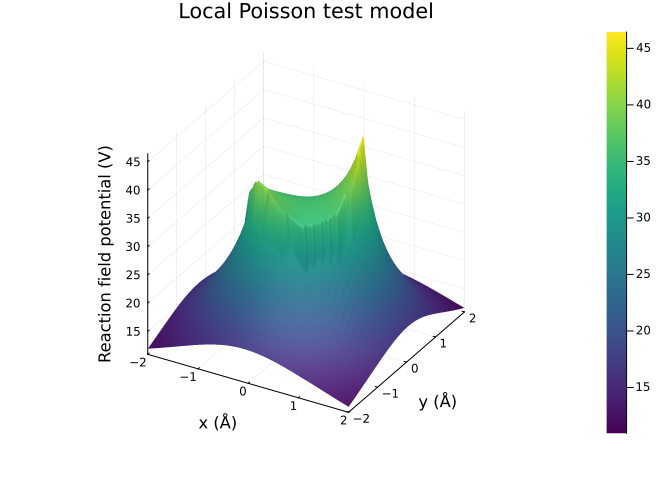
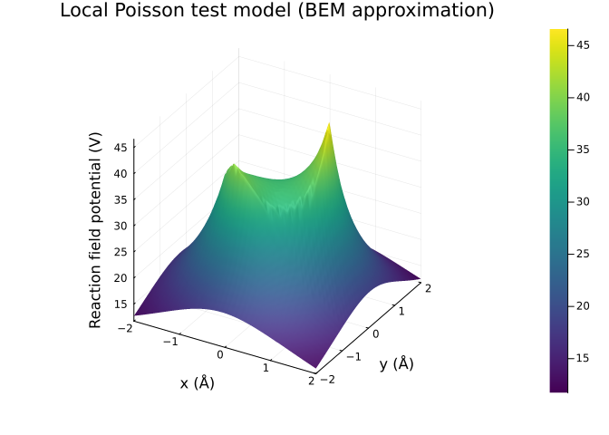
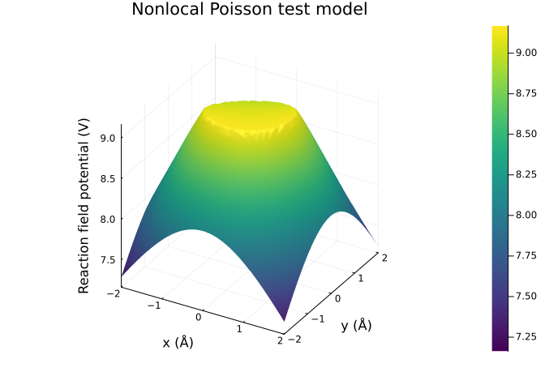
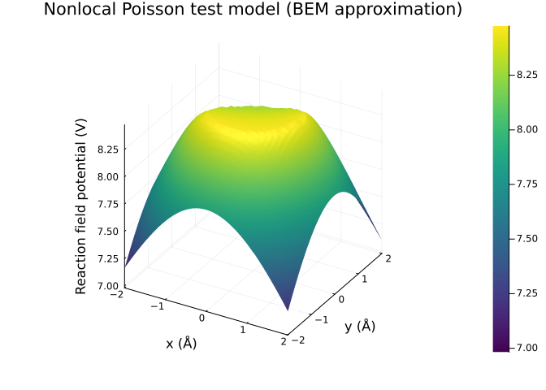
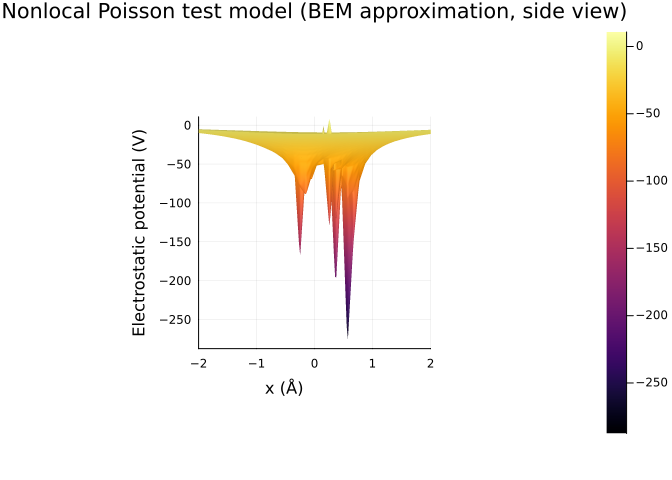

# Poisson test models


``` julia
lval = 2.0   # grid size [-lval, lval]² in xy-plane
gres = 40    # grid resolution (gres x gres)

# generate observation points
Ξ = collect(Iterators.flatten(obspoints_plane(
    [-lval, lval, zero(lval)],
    [-lval, -lval, zero(lval)],
    [ lval, -lval, zero(lval)],
    gres, gres
)))

# coordinate shorthand for plotting
plot_x = getindex.(Ξ, 1)
plot_y = getindex.(Ξ, 2);
```

``` julia
using NESSie.TestModel

opt = Option(2.0, 80.0, 2.0, 20.0)
xie = TestModel.XieSphere(1.0, Format.readpqr(nessie_data_path("xie/2LZX.pqr")), opt)
```

    NESSie.TestModel.XieSphere{Float64}(charges = 479, radius = 1.0)

## Local electrostatics

``` julia
using Plots

xie_local = LocalXieModel(xie, 20)

surface(plot_x, plot_y, rfpotential(Ξ, xie_local);
    title = "Local Poisson test model",
    xlabel = "x (Å)",
    ylabel = "y (Å)",
    zlabel = "Reaction field potential (V)",
    cmap = :viridis
)
```



``` julia
using NESSie.BEM

bem_local = solve(LocalES, Model(xie); method = :blas)

surface(plot_x, plot_y, rfpotential(Ξ, bem_local);
    title = "Local Poisson test model (BEM approximation)",
    xlabel = "x (Å)",
    ylabel = "y (Å)",
    zlabel = "Reaction field potential (V)",
    cmap = :viridis
)
```

    Info    : Meshing 1D...
    Info    : [ 40%] Meshing curve 2 (Circle)
    Info    : Done meshing 1D (Wall 9.7511e-05s, CPU 9.7e-05s)
    Info    : Meshing 2D...
    Info    : Meshing surface 1 (Sphere, Frontal-Delaunay)
    Info    : Done meshing 2D (Wall 0.0273876s, CPU 0.027377s)
    Info    : 976 nodes 1975 elements
    Info    : Writing '/tmp/jl_GJgVqP4Hyt.msh'...
    Info    : Done writing '/tmp/jl_GJgVqP4Hyt.msh'



## Nonlocal electrostatics

``` julia
xie_nonlocal = NonlocalXieModel2(xie, 20)

surface(plot_x, plot_y, rfpotential(Ξ, xie_nonlocal);
    title = "Nonlocal Poisson test model",
    xlabel = "x (Å)",
    ylabel = "y (Å)",
    zlabel = "Reaction field potential (V)",
    cmap = :viridis
)
```



``` julia
bem_nonlocal = solve(NonlocalES, Model(xie); method = :blas)

surface(plot_x, plot_y, rfpotential(Ξ, bem_nonlocal, surface_margin = 0.05);
    title = "Nonlocal Poisson test model (BEM approximation)",
    xlabel = "x (Å)",
    ylabel = "y (Å)",
    zlabel = "Reaction field potential (V)",
    cmap = :viridis
)
```

    Info    : Meshing 1D...
    Info    : [ 40%] Meshing curve 2 (Circle)
    Info    : Done meshing 1D (Wall 7.6232e-05s, CPU 7.6e-05s)
    Info    : Meshing 2D...
    Info    : Meshing surface 1 (Sphere, Frontal-Delaunay)
    Info    : Done meshing 2D (Wall 0.0252649s, CPU 0.025263s)
    Info    : 976 nodes 1975 elements
    Info    : Writing '/tmp/jl_wDgHeDeXmj.msh'...
    Info    : Done writing '/tmp/jl_wDgHeDeXmj.msh'



``` julia
surface(plot_x, plot_y, espotential(Ξ, bem_nonlocal);
    title = "Nonlocal Poisson test model (BEM approximation, side view)",
    xlabel = "x (Å)",
    zlabel = "Electrostatic potential (V)",
    camera = (0, 0),
    yticks = []
)
```


