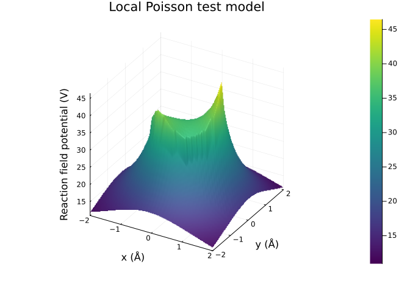
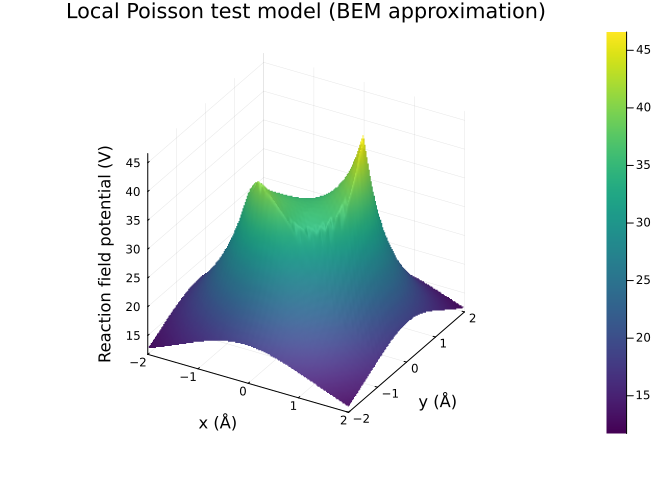
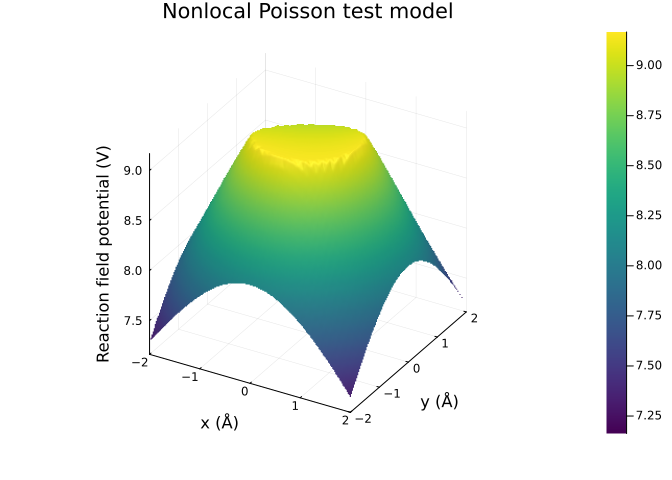
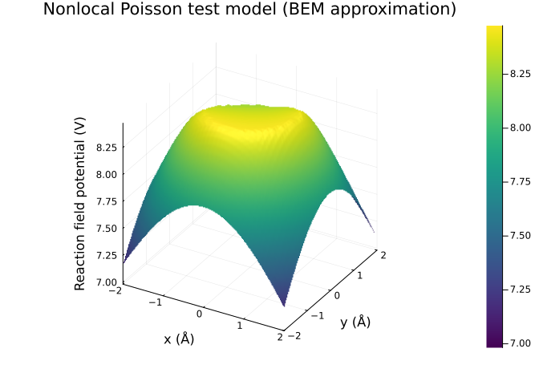
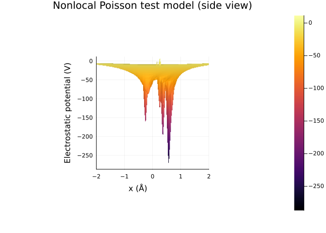
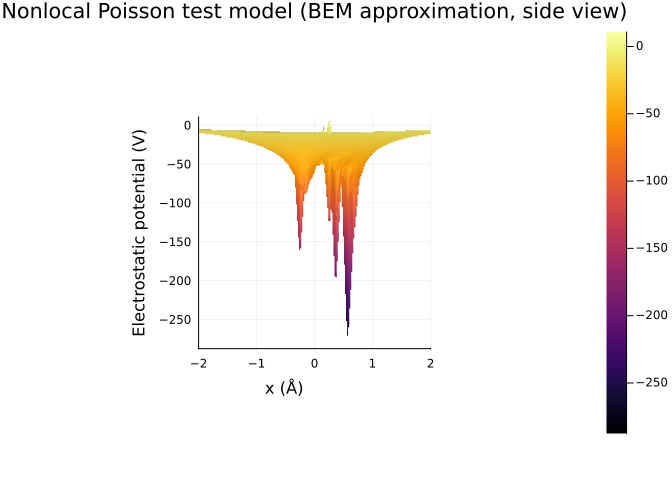

# Poisson test models


This tutorial demonstrates the Poisson test models provided by NESSie, which are based on the local and nonlocal Poisson dielectric models introduced in [\[Xie16\]](@ref "Bibliography"). These test models represent a protein structure embedded within a dielectric sphere. The corresponding point charges are automatically translated and rescaled to fit inside the sphere, providing a simple test system for validating our electrostatic solvers.

``` julia
using NESSie.TestModel

opt = Option(2.0, 80.0, 2.0, 20.0)
xie = TestModel.XieSphere(1.0, Format.readpqr(nessie_data_path("xie/2LZX.pqr")), opt)
```

    NESSie.TestModel.XieSphere{Float64}(charges = 479, radius = 1.0)

The setup above creates a [`TestModel.XieSphere`](@ref) model with radius 1 Å, loaded from the 2LZX PQR file shipped with NESSie, with dielectric parameters specified by [`Option`](@ref): solvent dielectric constant $\varepsilon_\Sigma = 80$, solute dielectric constant $\varepsilon_\Omega = 2$, high-frequency dielectric constant $\varepsilon_\infty = 2$, and correlation length $\lambda = 20$ Å.

Let’s also generate a grid of observation points `Ξ` in the xy-plane (z = 0) spanning the square region \[-2, 2\]² Å, used for plotting the electrostatic potentials:

``` julia
lval = 2.0   # grid size [-lval, lval]² in xy-plane
gres = 40    # grid resolution (gres x gres)

# generate observation points
x = range(-lval, lval, length=gres)
y = range(-lval, lval, length=gres)
Ξ = [[xi, yi, zero(xi)] for xi in x for yi in y]

# coordinate shorthand for plotting
plot_x = getindex.(Ξ, 1)
plot_y = getindex.(Ξ, 2);
```

## Local electrostatics

In the local Poisson dielectric model, the solvent response at any point depends only on the local electric field. The [`TestModel.LocalXieModel`](@ref) provides an analytical series solution to the local Poisson equation for a sphere containing embedded point charges. The number of terms `len = 20` (second constructor argument below) in the series controls the approximation accuracy.

``` julia
using Plots

xie_local = LocalXieModel(xie, 20)

surface(plot_x, plot_y, rfpotential(Ξ, xie_local);
    title = "Local Poisson test model",
    xlabel = "x (Å)",
    ylabel = "y (Å)",
    zlabel = "Reaction field potential (V)",
    cmap = :viridis
)
```



The surface plot above shows the **reaction field potential** computed from the analytical local model. The reaction field potential $\varphi^* = \varphi − \varphi_{mol}$ (the total electrostatic potential minus the molecular/Coulombic potential) captures the dielectric medium’s response to the embedded charges. The pattern shows the potential strongest near the charge locations projected onto the xy-plane, decaying toward the edges of the plot region.

Now, let’s move on to the BEM approximation:

``` julia
using NESSie.BEM

bem_local = solve(LocalES, Model(xie); method = :blas)

surface(plot_x, plot_y, rfpotential(Ξ, bem_local);
    title = "Local Poisson test model (BEM approximation)",
    xlabel = "x (Å)",
    ylabel = "y (Å)",
    zlabel = "Reaction field potential (V)",
    cmap = :viridis
)
```

    Info    : Meshing 1D...
    Info    : [ 40%] Meshing curve 2 (Circle)
    Info    : Done meshing 1D (Wall 9.0909e-05s, CPU 9.6e-05s)
    Info    : Meshing 2D...
    Info    : Meshing surface 1 (Sphere, Frontal-Delaunay)
    Info    : Done meshing 2D (Wall 0.0248435s, CPU 0.024791s)
    Info    : 976 nodes 1975 elements
    Info    : Writing '/tmp/jl_2Vk1Mn6XYF.msh'...
    Info    : Done writing '/tmp/jl_2Vk1Mn6XYF.msh'



The BEM solver provides a numerical approximation to the same local electrostatic problem. We first convert the [`TestModel.XieSphere`](@ref) into a triangle mesh via the [`Model`](@ref) constructor, then solve the boundary integral equation for the local electrostatic problem. As can be seen from the surface plot, the resulting reaction field potential closely matches the analytical solution.

## Nonlocal electrostatics

The nonlocal Poisson dielectric model accounts for short-range solvent–solvent correlations beyond the classical local description. In this framework, the solvent polarization at one point depends on the electric field in a neighborhood, not just at that single point. This is captured by an additional parameter, the correlation length $\lambda$, and a high-frequency dielectric constant $\varepsilon_\infty$.

The [`TestModel.NonlocalXieModel2`](@ref) implements the second nonlocal Poisson dielectric model from [\[Xie16\]](@ref "Bibliography"). Let’s once again start with the analytical reaction field potentials:

``` julia
xie_nonlocal = NonlocalXieModel2(xie, 20)

surface(plot_x, plot_y, rfpotential(Ξ, xie_nonlocal);
    title = "Nonlocal Poisson test model",
    xlabel = "x (Å)",
    ylabel = "y (Å)",
    zlabel = "Reaction field potential (V)",
    cmap = :viridis
)
```



Using the same workflow as in the local case, we can compute the corresponding BEM approximation:

``` julia
bem_nonlocal = solve(NonlocalES, Model(xie); method = :blas)

surface(plot_x, plot_y, rfpotential(Ξ, bem_nonlocal; surface_margin = 0.05);
    title = "Nonlocal Poisson test model (BEM approximation)",
    xlabel = "x (Å)",
    ylabel = "y (Å)",
    zlabel = "Reaction field potential (V)",
    cmap = :viridis
)
```

    Info    : Meshing 1D...
    Info    : [ 40%] Meshing curve 2 (Circle)
    Info    : Done meshing 1D (Wall 8.1993e-05s, CPU 8.6e-05s)
    Info    : Meshing 2D...
    Info    : Meshing surface 1 (Sphere, Frontal-Delaunay)
    Info    : Done meshing 2D (Wall 0.0256041s, CPU 0.025579s)
    Info    : 976 nodes 1975 elements
    Info    : Writing '/tmp/jl_I5IPSjqhoJ.msh'...
    Info    : Done writing '/tmp/jl_I5IPSjqhoJ.msh'



The `surface_margin = 0.05` parameter offsets the evaluation grid slightly above the molecular surface to avoid singularities when computing the BEM reaction field potential outside the domain. Again, the approximation resembles the analytical solution, albeit less closely as in the local case. The differences nearly vanish, however, in the full electrostatic potentials, which are dominated by the molecular potentials:

``` julia
surface(plot_x, plot_y, espotential(Ξ, xie_nonlocal);
    title = "Nonlocal Poisson test model (side view)",
    xlabel = "x (Å)",
    zlabel = "Electrostatic potential (V)",
    camera = (0, 0),
    yticks = []
)
```



``` julia
surface(plot_x, plot_y, espotential(Ξ, bem_nonlocal);
    title = "Nonlocal Poisson test model (BEM approximation, side view)",
    xlabel = "x (Å)",
    zlabel = "Electrostatic potential (V)",
    camera = (0, 0),
    yticks = []
)
```



We can also compare the polar solvation free energy (reaction field energy) between the
analytical models and their BEM approximations. NESSie provides the [`rfenergy`](@ref)
function for this:

``` julia
using Printf

@printf "Analytical local:     %.4f kJ/mol\n" rfenergy(xie_local)
@printf "BEM local:            %.4f kJ/mol\n" rfenergy(bem_local)
@printf "Analytical nonlocal:  %.4f kJ/mol\n" rfenergy(xie_nonlocal)
@printf "BEM nonlocal:         %.4f kJ/mol\n" rfenergy(bem_nonlocal)
```

    Analytical local:     -9288.3464 kJ/mol
    BEM local:            -9319.9194 kJ/mol
    Analytical nonlocal:  -2198.7490 kJ/mol
    BEM nonlocal:         -2030.8937 kJ/mol
